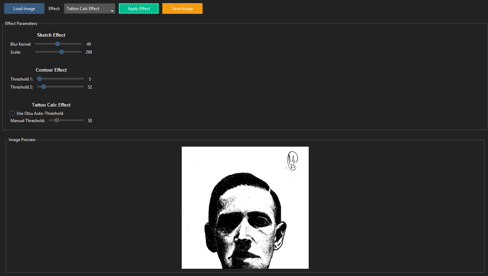

# 🎨 Tracify




A playful Python GUI app that takes your images and flips them into sketch effects, contour outlines, or even tattoo-ready stencils 🖌️.
Built with tkinter + ttkbootstrap + OpenCV, wrapped in a simple, user-friendly interface.

## ✅ Features

- **Sketch Effect**: Converts images into sketch-like drawings with darker lines and lighter shading for a realistic pencil effect.
- **Contour Effect**: Highlights edges and contours in the image, making it ideal for tracing or technical use.
- **Tattoo Template (Calc)**: Creates high-contrast binary images using adaptive thresholding for easy application on skin or as stencils for tattoos.
- **Grayscale Conversion**: Quickly converts images to grayscale.
- **Progress Bar**: Visual feedback during image processing.
- **Error Handling**: Comprehensive validation and user-friendly error messages.

## 🛠️ Tech Stack

- **Python 3.11+**
- **tkinter**: Native Python GUI framework
- **ttkbootstrap**: Modern themed tkinter widgets
- **OpenCV**: Advanced image processing
- **Pillow**: Image display and manipulation
- **pytest**: Comprehensive testing suite

## 🚀 Quick Start

### Prerequisites

- Python 3.11 or higher
- [uv](https://docs.astral.sh/uv/) package manager

### Installation

1. Clone the repository:
   ```bash
   git clone https://github.com/draprar/opencv-sketch-effects.git
   cd opencv-sketch-effects
   ```

2. Install dependencies using uv:
   ```bash
   uv sync
   ```

3. Run the application:
   ```bash
   uv run tracify
   ```

   Or alternatively:
   ```bash
   uv run python -m tracify.main
   ```

## 🖼️ How it works

1. **Load an Image**:
   - Click the "Load Image" button and select a file from your system.
   - Supported formats: PNG, JPG, JPEG, BMP, TIFF
   - Maximum image size: 4096×4096 pixels

2. **Apply Effects**:
   - Choose an effect from the dropdown menu.
   - Click "Apply Effect" to process the image.
   - A progress bar will show during processing.

3. **Save the Result**:
   - After applying an effect, click "Save Image" to store the processed image on your computer.

## 🧪 Development

### Using Makefile (Recommended)

```bash
make help          # Show all available commands
make install       # Install dependencies
make test          # Run tests with coverage
make lint          # Run linter
make format        # Format code
make typecheck     # Run type checker
make security      # Run security scanners
make ci            # Run all CI checks locally
make run           # Run the application
```

### Manual Commands

#### Run Tests

```bash
uv run pytest
```

#### Run Tests with Coverage

```bash
uv run pytest --cov=src/tracify --cov-report=html
```

#### Linting

```bash
uv run ruff check src/ tests/
```

#### Format Code

```bash
uv run ruff format src/ tests/
```

#### Type Checking

```bash
uv run mypy src/
```

#### Security Scanning

```bash
uv run bandit -r src/
```

### Pre-commit Hooks

Install pre-commit hooks to automatically check code before commits:

```bash
uv run pre-commit install
```

Run pre-commit manually:

```bash
uv run pre-commit run --all-files
```

## 📁 Project Structure

```
opencv-sketch-effects/
├── src/
│   └── tracify/
│       ├── __init__.py
│       ├── main.py              # GUI application
│       └── image_processor.py   # Image processing logic
├── tests/
│   ├── test_main.py            # GUI tests
│   └── test_image_processor.py # Logic tests
├── .github/
│   └── workflows/
│       └── python-app.yml      # CI/CD pipeline
├── media/                      # Screenshots
├── pyproject.toml             # Project configuration
├── uv.lock                    # Dependency lock file
├── .gitignore
├── LICENSE
└── README.md
```

## 🔒 Security & Quality

This project uses:
- **ruff** for fast linting and formatting
- **mypy** for type checking
- **bandit** for security scanning
- **pytest** with comprehensive test coverage
- **GitHub Actions** CI/CD pipeline

## 🐛 Known Limitations

- Maximum image size: 4096×4096 pixels (to prevent memory issues)
- Supported formats: PNG, JPG, JPEG, BMP, TIFF
- Processing large images may take a few seconds

## 🤝 Contributing

Contributions are welcome! Please ensure:
1. All tests pass: `uv run pytest`
2. Code is formatted: `uv run ruff format src/ tests/`
3. No linting errors: `uv run ruff check src/ tests/`
4. Type checking passes: `uv run mypy src/`

## 📄 License

MIT License - see [LICENSE](LICENSE) file for details.

## 👤 Credits

- **Developer**: Walery ([@draprar](https://github.com/draprar/))
- Built with ❤️ using Python, tkinter, and OpenCV

## 🆘 Troubleshooting

### "Image too large" error
Resize your image to 4096×4096 or smaller using an image editor.

### "Could not read image" error
Ensure the file is a valid image format (PNG, JPG, BMP, etc.) and not corrupted.

### Application doesn't start
Make sure you have Python 3.11+ installed and all dependencies are installed via `uv sync`.

### Tests failing on tkinter
Some systems may require additional tkinter setup. On Ubuntu/Debian:
```bash
sudo apt-get install python3-tk
```
